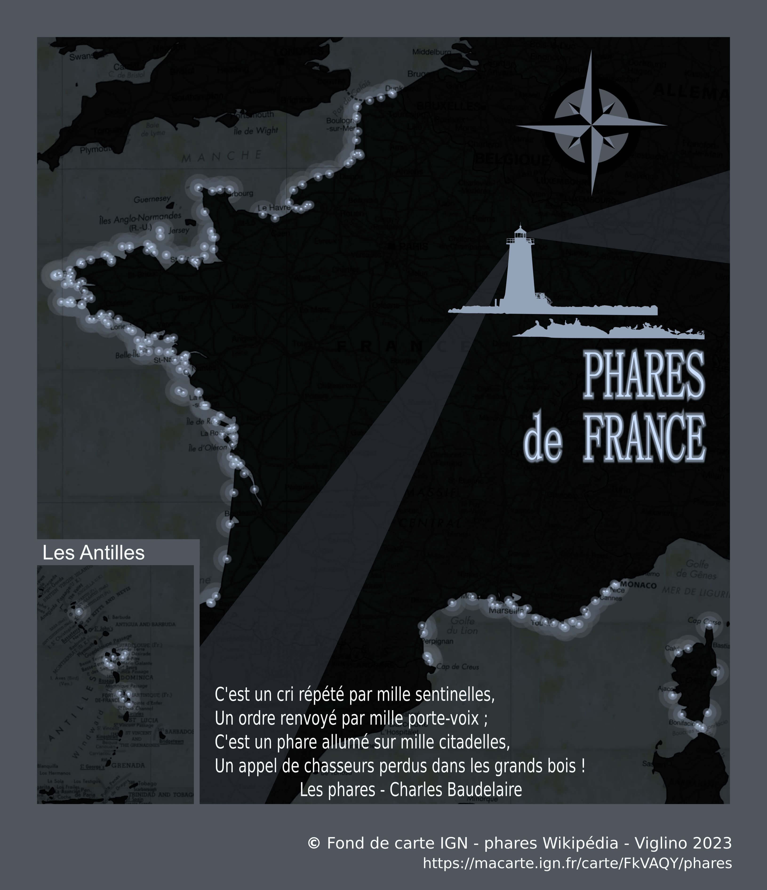

# Day 1 - Points

Pour ce premier jour, je me suis inspiré librement d'une carte des phares faite par [@researchremora](https://twitter.com/researchremora/status/1708936472286351694) avec R et rayshader.   
Les données viennent de Wikipédia (récupérés via leur API) qui permet facilement d'avoir une [liste de phares](https://fr.wikipedia.org/wiki/Liste_des_phares_de_France) ainsi qu'un résumé et une photo de ceux-ci. Si la carte n'atteint pas le rendu de @researchremora avec rayshader, le résultat ne dénote pas.   
Le poster a été réalisé avec Inkscape pour habiller la carte et lui ajouter un titre et une illustration.

{: .center }
{:width="550px"}{: .fullscreen }    
[Voir la carte en ligne](https://macarte.ign.fr/carte/FkVAQY/Phares-de-France){:target="macarte"}

{: .center }
[{:width="40px"}](https://twitter.com/jmviglino/status/1719600713062350910)

{: .center }
{:width="300px"}   
*La carte de l'inspiration*

