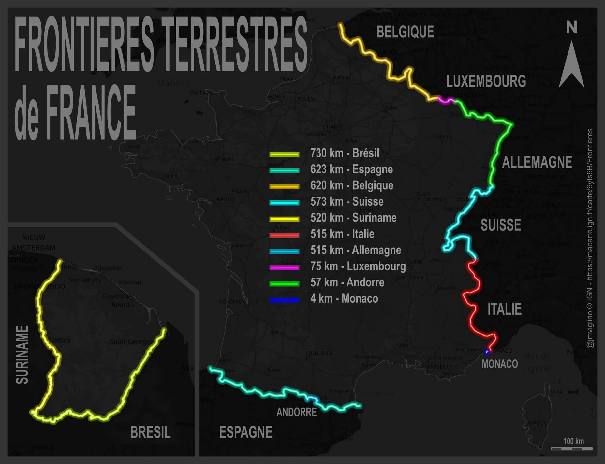

# Day 12 - South America

Comme la Guyanne est en France et en Amérique du Sud, quoi de plus naturel pour ce jour 12 que de la mettre à l'honneur, d'autant que c'est la plus grande frontière terrestre de la France avec un autre pays.

{: .center }
{:width="550px"}{: .fullscreen }    
[Voir la carte narrative](https://macarte.ign.fr/carte/9yIs9B/Frontieres){:target="macarte"}

{: .center }
[{:width="40px"}](https://twitter.com/jmviglino/status/1723583422906438101)
