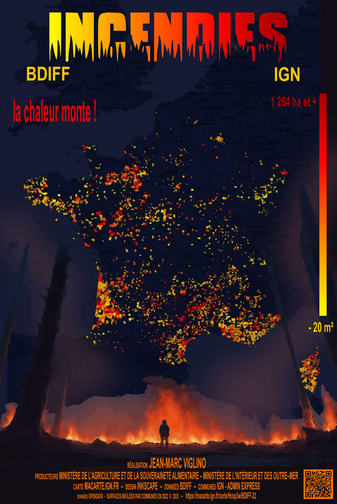

# Day 13 - Choropleth

Au départ, j'étais parti pour faire une carte choroplèthe à partir des feux de forêts de la [BDIFF](https://bdiff.agriculture.gouv.fr/) et au final, j'ai fait une affiche de film catastrophe !

{: .center }
{:width="550px"}{: .fullscreen }    
[Voir la carte en ligne](https://macarte.ign.fr/carte/Hcsp3w/Incendies22){:target="macarte"}

{: .center }
[{:width="40px"}](https://twitter.com/jmviglino/status/1723961814512541922)
