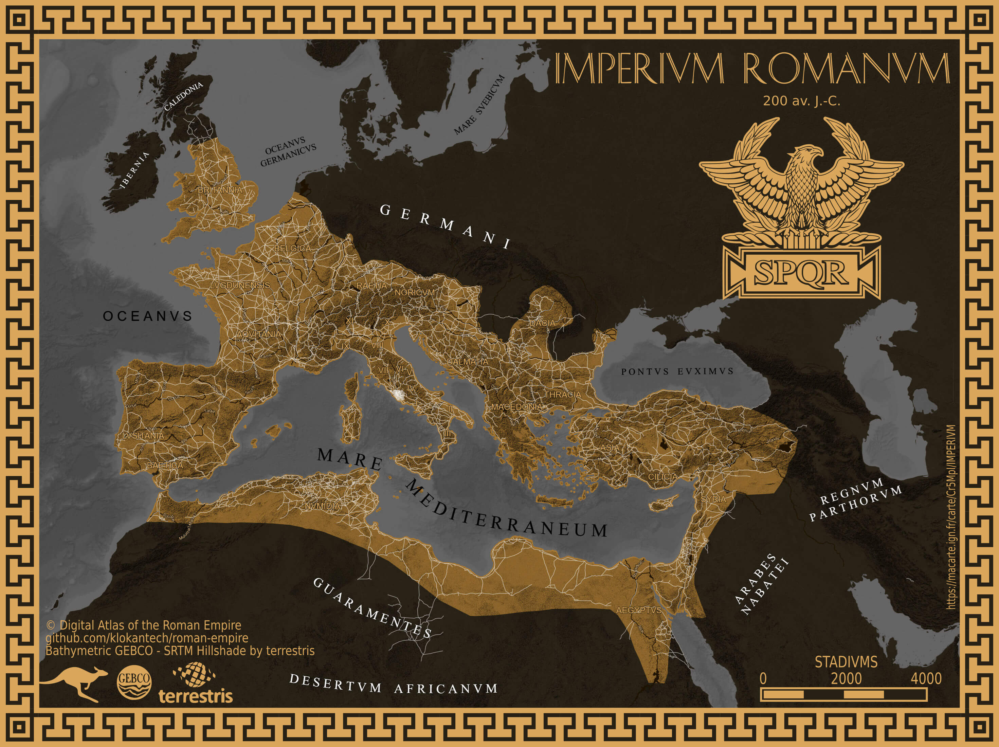

# Day 14 - Europe

A l'occasion du jour 14, je me suis aperçu qu'il existait un [atlas de l'empire romain](https://github.com/klokantech/roman-empire/) avec un tas de données disponibles. Cela m'a donné l'occasion de réaliser cette carte de l'Empire Romain sur Ma carte.

{: .center }
{:width="550px"}{: .fullscreen }    
[Voir la carte en ligne](https://macarte.ign.fr/carte/Cr5MpI/IMPERIVM-ROMANUM){:target="macarte"}

{: .center }
[{:width="40px"}](https://twitter.com/jmviglino/status/1724321250950967346)
