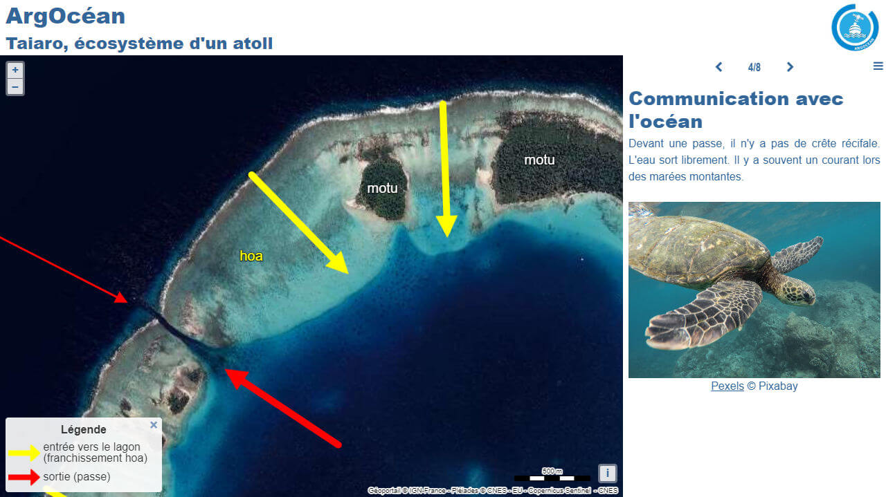

# Day 16 - Oceania

Si vous ne connaissez pas le site du [CNES](https://enseignants-mediateurs.cnes.fr/fr), je vous le conseille, il fourmille de contenus pédagogique et parmi eux, [Argocéan Taiaro](https://enseignants-mediateurs.cnes.fr/fr/cnes-projet-educatif-argocean-taiaro) propose un projet éducatif sur un atoll du Pacifique.   
J'en ai donc profité pour faire une carte narrative expliquant le projet en géoréférençant les différentes les images satellite des îles décrites sur le site.

{: .center }
{:width="550px"}{: .fullscreen }    
[Voir la carte narrative](https://macarte.ign.fr/carte/APLiSg/ArgOcean){:target="macarte"}

{: .center }
[{:width="40px"}](https://twitter.com/jmviglino/status/1725046507315810648)
