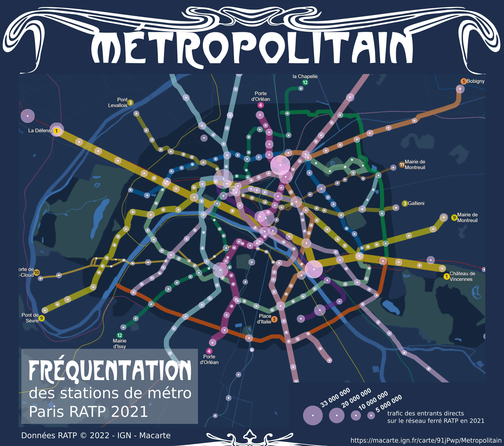

# Day 17 - Flow

Pour la carte des flux, je suis partie de la frésquentation des stations du métro parisien proposée par [la RATP](https://data.ratp.fr/explore/dataset/trafic-annuel-entrant-par-station-du-reseau-ferre-2021/information/), avec un look très "métropolitain".

{: .center }
{:width="550px"}{: .fullscreen }    
[Voir la carte en ligne](https://macarte.ign.fr/carte/91jPwp/Metropolitain){:target="macarte"}

{: .center }
[{:width="40px"}](https://twitter.com/jmviglino/status/1725414565129646220)
