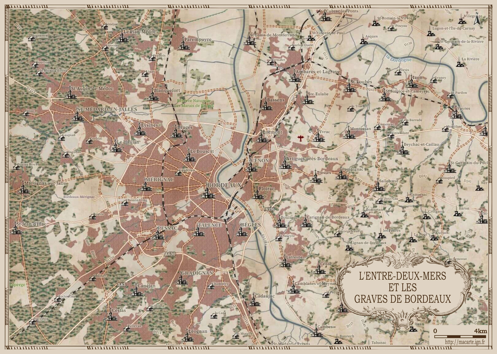

# Day 19 - 5mn map

Pour le jour 19, j'ai repris l'idée du jour 11 (rétro) avec des [tuiles vectorielles de l'IGN](https://geoservices.ign.fr/actualites/2022-03-30-tuiles-vectorielles) et une symbolisation façon carte de Cassini, afin de proposer de faire sa propre carte en moins de 5mn chrono.

{: .center }
{:width="550px"}{: .fullscreen }    
[Voir la carte narrative](https://macarte.ign.fr/carte/FxwkSm/Ma-Cassini){:target="macarte"}

{: .center }
[{:width="40px"}](https://twitter.com/jmviglino/status/1726226115457647008)

<iframe width="560" height="315" src="https://www.youtube.com/embed/tC8Zar5dyiY?si=EiOL82yURl_0_MFM" title="YouTube video player" frameborder="0" allow="accelerometer; autoplay; clipboard-write; encrypted-media; gyroscope; picture-in-picture; web-share" allowfullscreen></iframe>