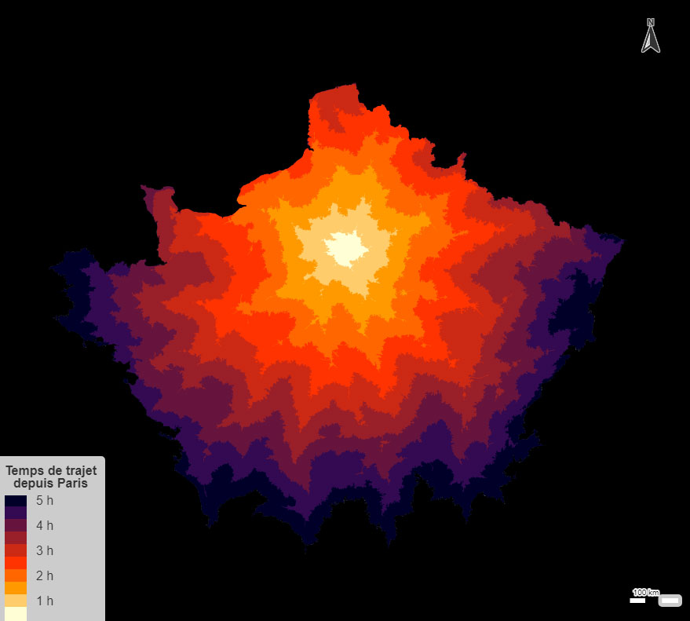

# Day 2 - Lines

Pour le jour des lignes, j'ai calculé des isochrones à partir de Paris avec [l'API du Géoportail](https://viglino.github.io/ol-ext/examples/routing/map.control.isochrone.html), auxquels j'ai associé un dégradé de couleurs en fonction du temps de parcours. J'utilise ensuite une couche vecteur tuilé de l'IGN avec un style "noir et blanc" pour symboliser le réseau routier. La fusion des 2 couche donne cet effet de dégradé en fonction de la distance sur l'ensemble du réseau routier.

{: .center }
{:width="400px"}{: .fullscreen }    
*La couche d'isochrones*

{: .center }
{:width="550px"}{: .fullscreen }    
[Voir la carte en ligne](https://macarte.ign.fr/carte/oA7ssf/Distance-Paris){:target="macarte"}

{: .center }
[{:width="40px"}](https://twitter.com/jmviglino/status/1719972609809367513)
