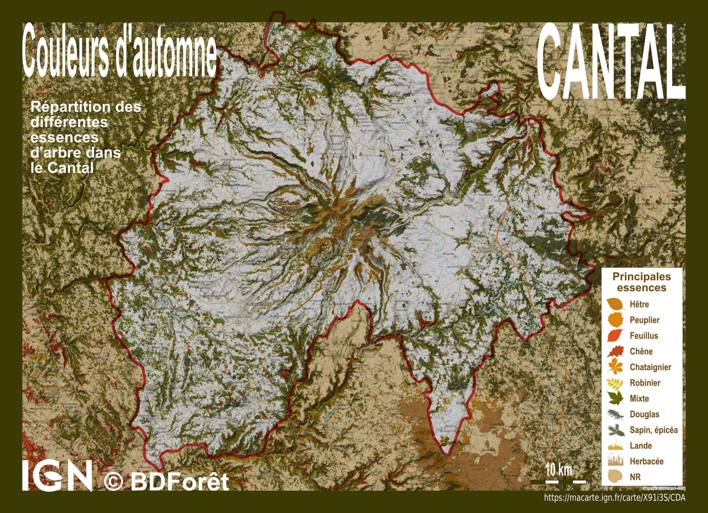

# Day 20 - Outdoor

Aviez-vous remarqué que le Cantal avait une forme de feuille ? 🍁   
Pour illustrer la thématique outdoor, voici une carte au couleurs d'automne faite à partir de la [BDForêt](https://geoservices.ign.fr/bdforet) de l'IGN.

{: .center }
{:width="550px"}{: .fullscreen }    
[Voir la carte en ligne](https://macarte.ign.fr/carte/X91i3S/Couleur-d-automne){:target="macarte"}

{: .center }
[{:width="40px"}](https://twitter.com/jmviglino/status/1726507642083045386)
