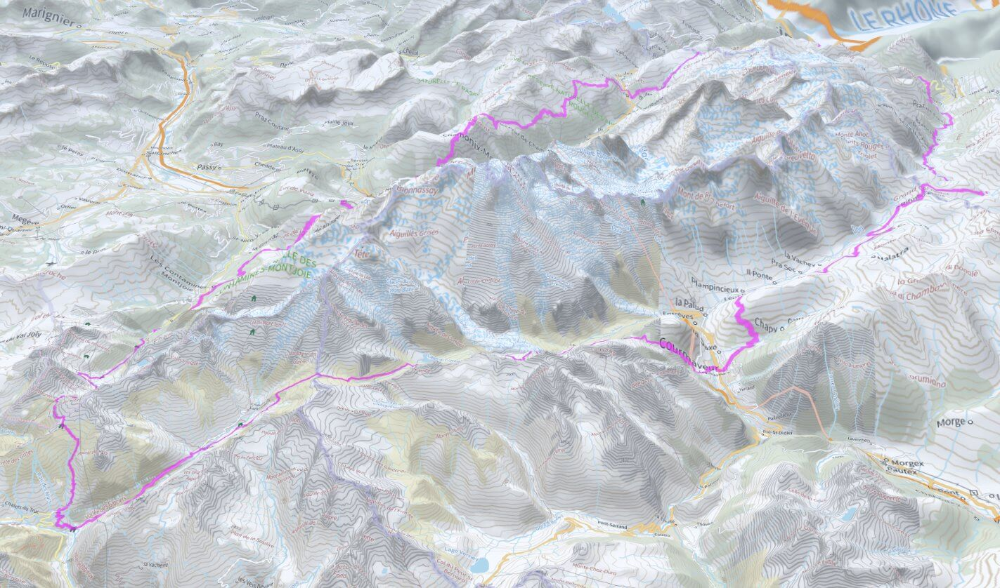

# Day 23 - 3D

Pour illustrer la 3D, une petite carte pour faire le tour du Mont-Blanc en rando. Et sa version 3D.

{: .center }
{:width="550px"}{: .fullscreen }    
[Voir la carte en ligne](https://macarte.ign.fr/carte/iv2im1/Tour-du-Mont-Blanc){:target="macarte"}

{: .center }
{:width="550px"}{: .fullscreen }    
[Voir la carte en 3D](https://ignf-ma-carte.github.io/mcviewer3D/?map=iv2im1){:target="macarte"}

{: .center }
[{:width="40px"}](https://twitter.com/jmviglino/status/1727657615579050459)

<iframe width="560" height="315" src="https://www.youtube.com/embed/ymLOy7ZzlhM?si=Ez8ccC27t8Qeiv6T" title="YouTube video player" frameborder="0" allow="accelerometer; autoplay; clipboard-write; encrypted-media; gyroscope; picture-in-picture; web-share" allowfullscreen></iframe>
