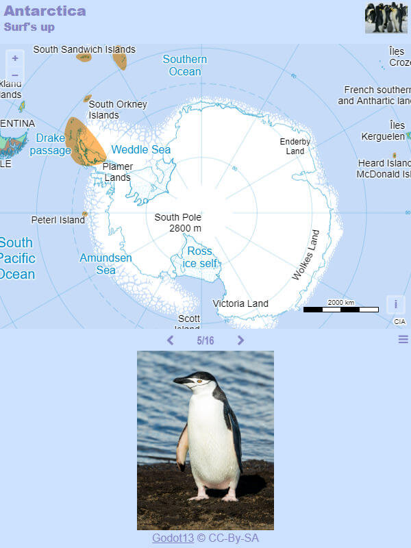

# Day 25 - Antarctica

Une carte des pingouins pour ce jour 25 sur l'Antarctique. Outre la localisation des colonies de pingouins, j'utilise la base [xeno-canto](https://xeno-canto.org/) accéderpour faire découvrir le cris de ses animaux venus du froid.

{: .center }
{:width="550px"}{: .fullscreen }    
[Voir la carte en ligne](https://macarte.ign.fr/carte/COg3MM/Antarctica){:target="macarte"}

{: .center }
[{:width="40px"}](https://twitter.com/jmviglino/status/1728463896481087659)
