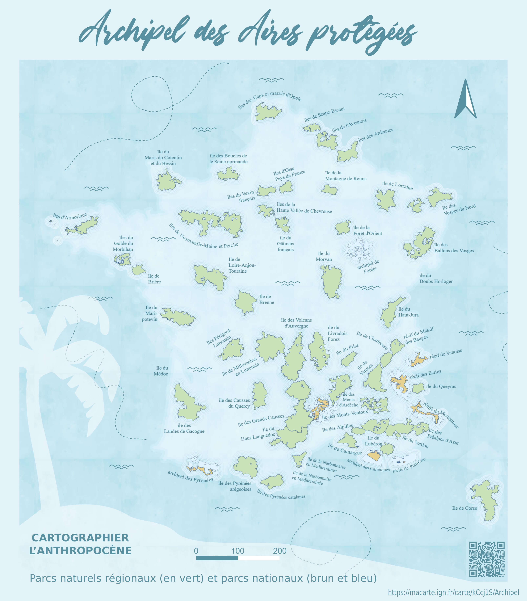

# Day 3 - Polygons

Ici, j'ai repris la carte faite pas [Lucas Destrem](https://twitter.com/LucasDestrem) pour [l'atlas de l'anthropocène](https://www.ign.fr/atlas-ign-des-cartes-de-lanthropocene-2023-occupation-sols) de l'IGN, avec son aimable autorisation. Le rendu de cette carte m'a tout de suite fasciné et j'espère que la version interactive tient ses promesses.

{: .center }
{:width="550px"}{: .fullscreen }    
[Voir la carte en ligne](https://macarte.ign.fr/carte/kCcj1S/Archipel){:target="macarte"}

{: .center }
[{:width="40px"}](https://twitter.com/jmviglino/status/1720345489583784013)

{: .idea }
[Voir les autres cartes de Lucas](https://www.ign.fr/files/default/2023-10/portfolio_lucas_destrem.pdf)
