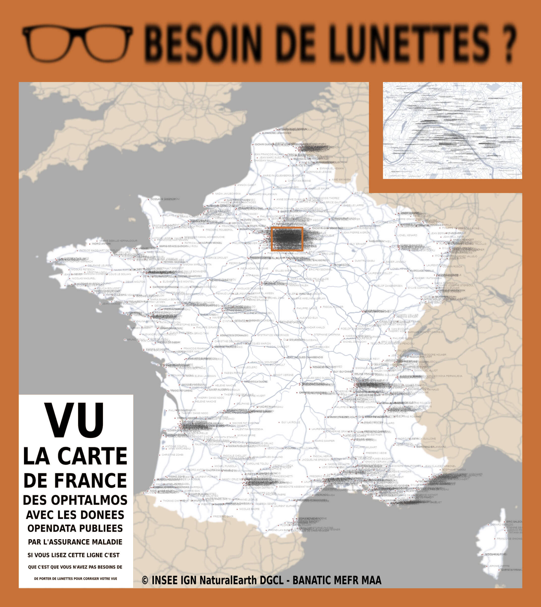

# Day 4 - Bad map

Qu'est-ce qu'une mauvaise carte ? Une carte qu'on n'arrive pas à lire ? Dans ce cas, il suffit de s'acheter des lunettes !

C'est l'idée de départ de cette carte des ophtalmologistes faite avec les [données de la 
Caisse nationale de l'assurance maladie](https://www.data.gouv.fr/fr/datasets/annuaire-sante-de-la-cnam/).

{: .center }
{:width="550px"}{: .fullscreen }    
[Voir la carte en ligne](https://macarte.ign.fr/carte/vtN7NZ/Ophtalmo){:target="macarte"}

{: .center }
[{:width="40px"}](https://twitter.com/jmviglino/status/1720698643161002430)

{: .note }
Cette carte a été choisie par [Makina Corpus](https://makina-corpus.com/sig-cartographie/retour-30daymapchallenge-2023) pour le jour 4 du challenge : "Bad map"...    
Du coup je me pose des questions : c'est la meilleure des bad map ou la plus nulle ?