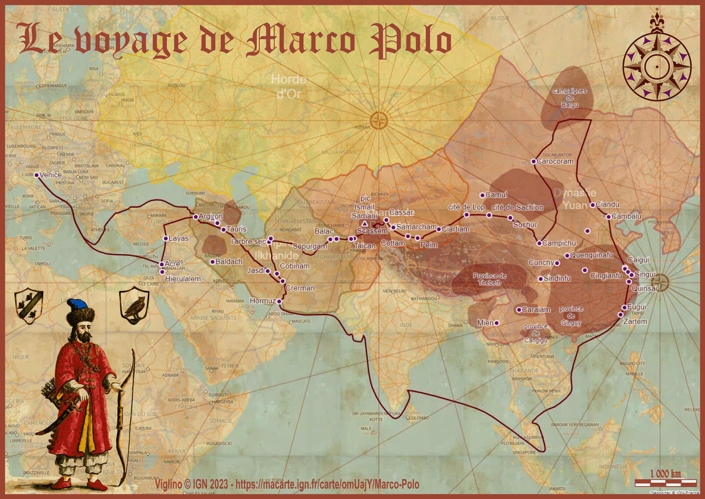

# Day 6 - Asia

Pour l'Asie, j'ai choisi de cartographier le voyage de Macro Polo (projet que j'avais de longue date). J'ai pu m'inspirer de [l'exposition virtuelle](http://expositions.bnf.fr/ciel/catalan/marco/page1.htm) et des [ressources associée](https://essentiels.bnf.fr/fr/mot-cle/62a2e3af-85b4-486e-93e7-16687f2eb808-marco-polo) sur le site de la BnF qui m'a fourni des images pour illustrer la storymap. J'ai aussi relu le Devisement du Monde sur Wikisource, dans sa [version originale](https://fr.wikisource.org/wiki/La_description_g%C3%A9ographique_des_provinces/Texte_entier) et en [français moderne](https://fr.wikisource.org/wiki/Voyage_de_Marco_Polo).

{: .center }
{:width="550px"}{: .fullscreen }    
[Voir la carte narrative](https://macarte.ign.fr/carte/omUajY/Marco-Polo){:target="macarte"}

{: .center }
[{:width="40px"}](https://twitter.com/jmviglino/status/1721439738597351487)
