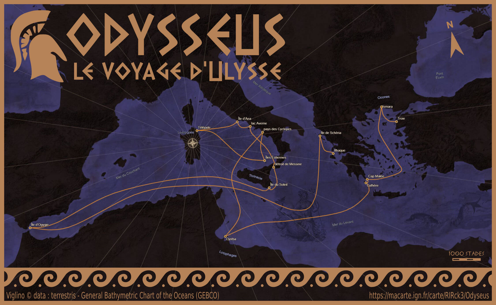

# Day 7 - Navigation

Pour la navigation, je suis parti sur le voyage d'Ulysse. Il y a un excellent article sur le blogue Cartographie(s) Numérique(s) : [Comment cartographier un mythe ?](https://cartonumerique.blogspot.com/2019/03/le-voyage-d-ulysse.html).   
Au final, je suis assez content du résultat, avec le fond [GEBCO](https://www.gebco.net/) pour le relief marin et l'ajout de monstres et les dieux.

{: .note }
J'avoue que j'ai un petit faible pour les illustration de [François-Louis Schmied](https://commons.wikimedia.org/w/index.php?search=Schmied+illustration+Odyss%C3%A9e&title=Special:MediaSearch&go=Go&type=image).

{: .center }
{:width="550px"}{: .fullscreen }    
[Voir la carte narrative](https://macarte.ign.fr/carte/RIRck3/Odyseus){:target="macarte"}

{: .center }
[{:width="40px"}](https://twitter.com/jmviglino/status/1721797274248864215)

{: .center }
    
[Illustration de François-Louis Schmied](https://commons.wikimedia.org/wiki/File:Schmied_illustration_Odyss%C3%A9e-CompBibliophilesAutoClubFrance-1932vol4p169.png) pour "L'Odyssée" d'Homère. Paris, Compagnie des bibliophiles de l'Automobile-Club de France, 1928, volume 4, page 169.
