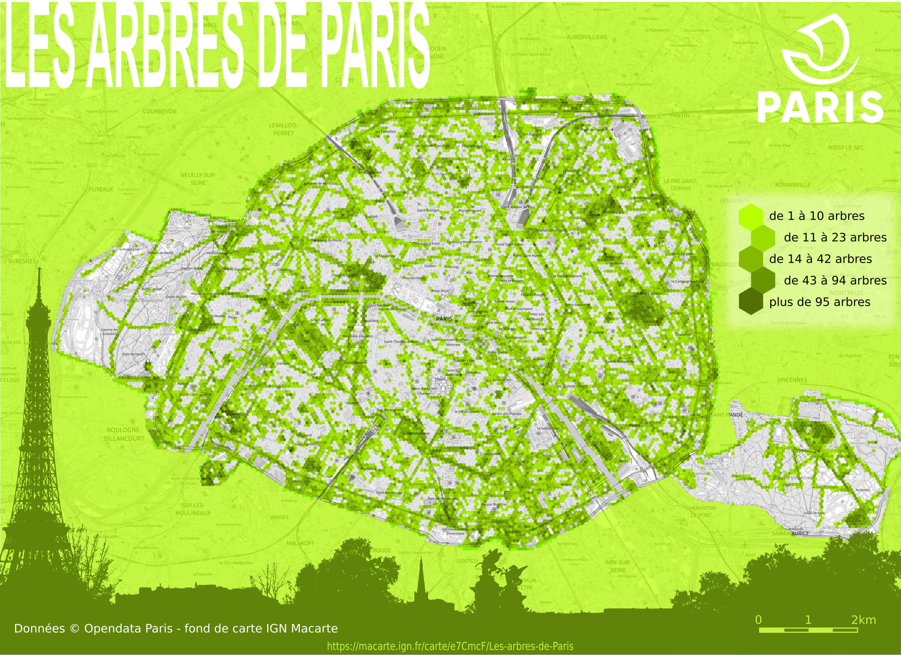

# Day 9 - Hexagons

Pour illustrer les hexagones sur une carte, j'ai choisi une carte avec des collecteurs hexagonaux afin d'agréger les donnée sur les arbres [de la plateforme opendata de la ville de Paris](https://opendata.paris.fr/explore/dataset/les-arbres).

{: .center }
{:width="550px"}{: .fullscreen }    
[Voir la carte en ligne](https://macarte.ign.fr/carte/e7CmcF/Les-arbres-de-Paris){:target="macarte"}

{: .center }
[{:width="40px"}](https://twitter.com/jmviglino/status/1722531070229270920)
