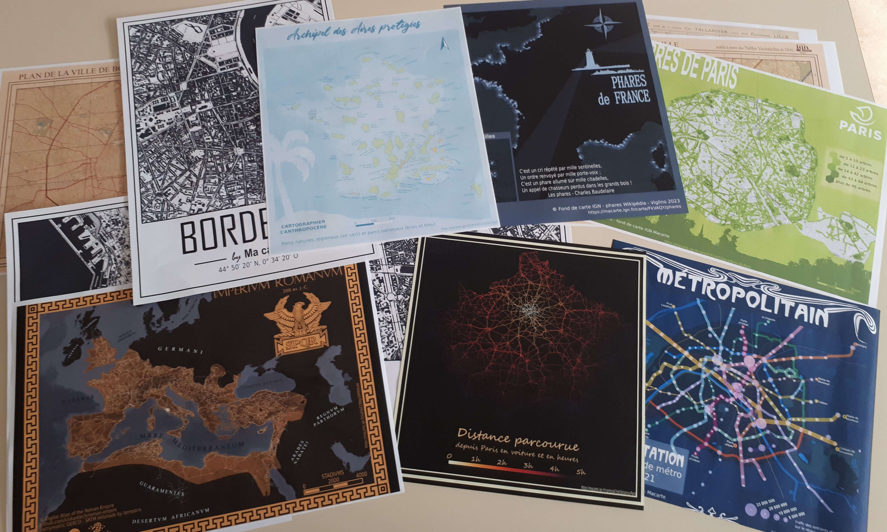

# My #30DayMapChallenge 2023

Le #30DayMapChallenge est un défi lancé en 2019 par [Topi Tjukanov](https://tjukanov.org/), un cartographe Finlandais. Cela consiste à publier chaque jour une carte sur une thématique imposée.

{: .idea }
Pas de jury ni de vainqueurs, juste un espace de partage pour les cartographes en herbe et plus professionnel pour présenter leurs créations et confronter des idées.

En quelques années, l'initiative s'est considérablement développée à travers le monde, avec des milliers d'artistes s'inscrivant chaque mois d'octobre.    
Cette initiative m'a permis de découvrir de nombreux professionnels de l'informatique et de la cartographie qui font un travail formidable et qui sont autant de sources de découvertes et d'inspirations.

Cette année j'ai décidé de participer en créant chaque jour un poster et une carte interactive pour poursuivre l'expérience du poster avec le site [Ma carte](https://macarte.ign.fr/) d'IGN-France. Dans la majorité des cas, le poster est créer à partir de la carte interactive repris sur Inkscape.

{: .note }
Pour suivre le challenge, cherchez le hastag `#30DayMapChallenge` sur les réseaux sociaux.
Un site internet recense également toutes les informations sur ce challenge : [30daymapchallenge.com](https://30daymapchallenge.com/)

{: .tag }
Si vous cherchez Makina Corpus propose [une rétrospective](https://makina-corpus.com/sig-cartographie/retour-30daymapchallenge-2023) du challenge et une [sélection de cartes](https://github.com/makinacorpus/30DayMapChallenge/tree/main/30DayMapChallenge2023).